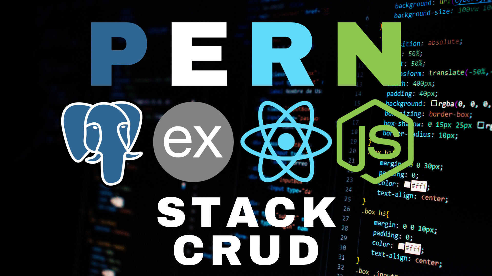

# PERN-STACK-CRUD



## INTRODUCTION

In this project we will create a full stack web application using **PostgreSQL**, **Express.js**, **React** and **Node.js**, also known as **PERN STACK**, and **Material UI**, an open source React component library that implements Google's Material Design.

## TECHNOLOGIES

- Node.js
- React
- Express.js
- PostgreSQL
- MUI

## INSTALLATION

1. Install the recommended version for most users of **Node.js** from the following link.

https://nodejs.org/en

2. Install the latest stable version of **PostgreSQL** from the following link.

https://www.postgresql.org/

3. Use the **npm** package manager to install.
4. Execute the command from the terminal located at ./PERN-STACK-CRUD and ./PERN-STACK-CRUD/client.

```shell
npm i
```

5. Create a database using the commands found inside the database folder in the db.sql file.
6. Create an .env file inside ./PERN-STACK-CRUD and replace `userpostgres` and `passwordpostgres` with your credentials.

```js
DB_USER = userpostgres
DB_PASSWORD = passwordpostgres
DB_HOST = localhost
DB_PORT = 5432
DB_NAME = tasksdb
```

## EXECUTION

7. Use the **npm** package manager to run.
8. To run the server execute the command from the terminal located at ./PERN-STACK-CRUD.

```shell
npm run dev
```

9. To run the client execute the command from the terminal located at ./PERN-STACK-CRUD/client.

```shell
npm start
```